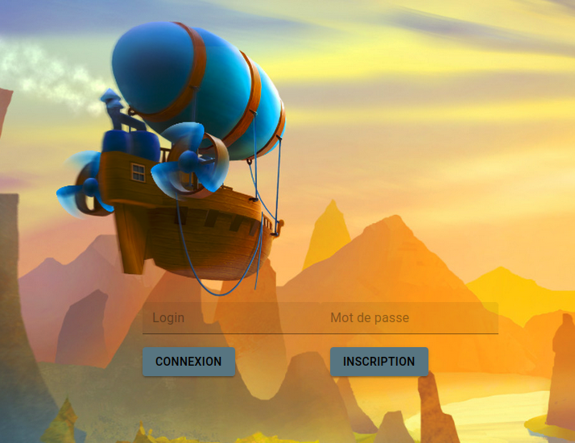
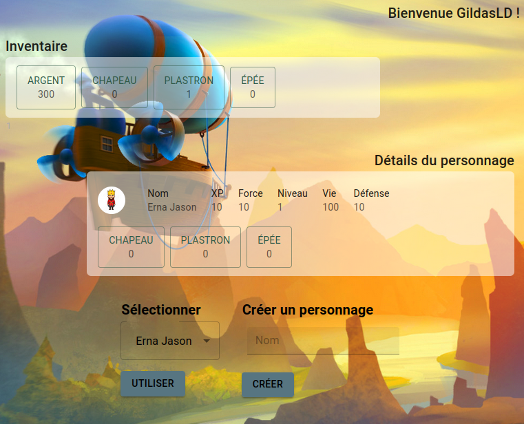
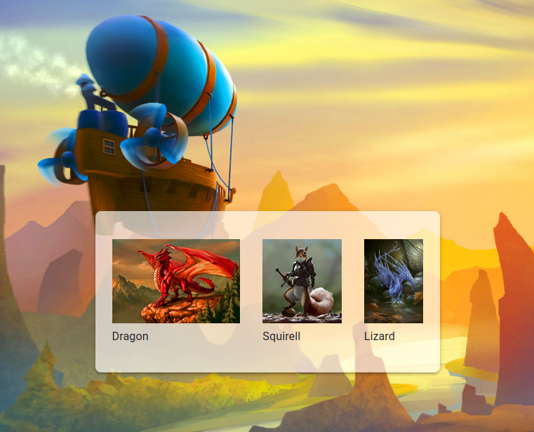
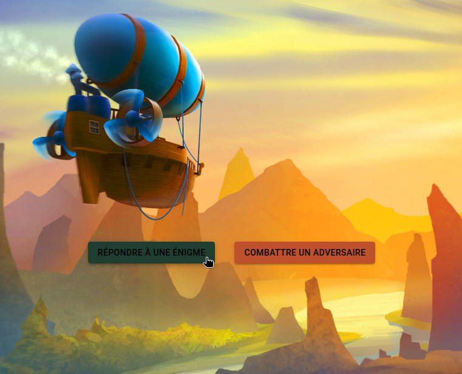
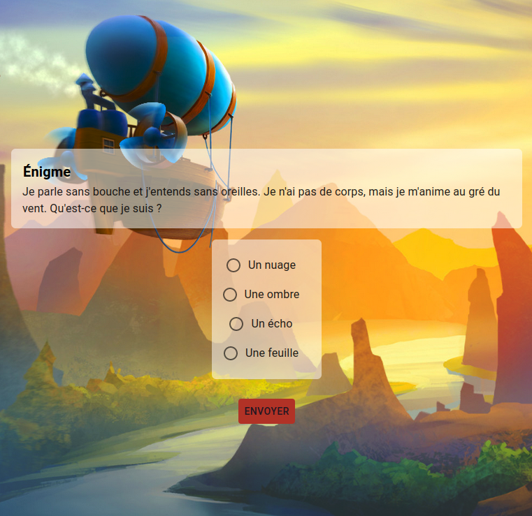
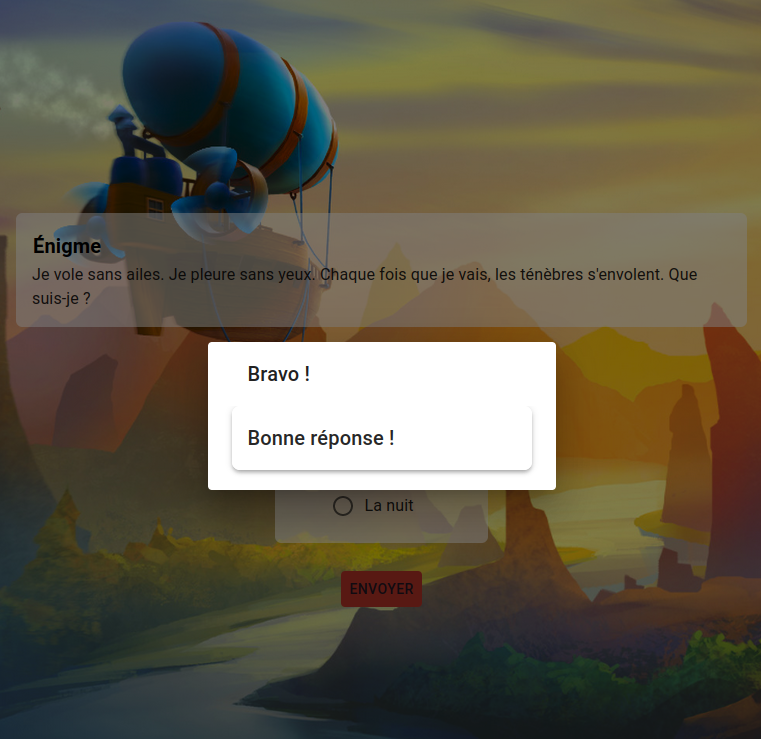

Login : GildasLD:bob

### W4 - Ruby

## RoR - Mediaval RPG

## Introduction

Ce projet a pour but de créer une communauté autour du RPG. Vous devrez créer un outil qui permet à un maître de jeu de faire évoluer des joueurs à travers un ensemble de quêtes.

## Fonctionnalités

### Maître du jeu

Vous devez créer une interface qui permet de créer des quêtes. Une quête est divisée en plusieurs étapes. A chaque fois qu’une étape est réussie, il est possible de répondre à l’énigme ou de combattre un PNJ. Il faut donc implémenter pour chaque quête :

- Plusieurs étapes qui sont chacunes composées de 2 choix :
- Soit de répondre à l’énigme (1 question, plusieurs réponses).
- Soit de combattre le PNJ qui dispose de caractéristiques « Vie » et « Force ».

Un PNJ dipose également d’un avatar.

- Après chaque étape, le joueur reçoit un peu d’expérience.
- En fin de quête, le personnage reçoit beaucoup d’expérience et gagne un objet à équiper.
- Il devra donc être possible, en plus de modifier les quêtes, d’ajouter des équipements, dotés de caractéristiques ainsi que d’une image.
- Absolument tout le jeu doit être modifiable par le maître du jeu.

### Joueur

- Vous devez créer une interface qui permet de consulter ses caractéristiques (Expérience, Vie et Force)
- Ainsi qu’un inventaire permettant d’équiper 3 objets (chapeau, arme, bouclier), que le joueur peut choisir parmi son inventaire.
- Chaque objet altère la Force, la Vie, peut accroître l’expérience gagnée à chaque étape, ou bien plusieurs de ces bonus/malus à la fois. En fin de quête, il est proposé au joueur de récupérer 1 objet parmi plusieurs qui lui sont proposés.

## Interface

Vous devez créer une page d’accueil qui permet de créer un nouveau personnage ou choisir un personnage déjà existant. Ensuite, vous devez avoir un menu qui permet de :

- Consulter ses caractéristiques.
- Gérer son inventaire.
- Choisir une nouvelle quête dans une liste ou continuer une quête en cours. Avoir accès à l’énigme et aux différentes options possibles.

## Combattre un PNJ

Pour chaque étape, le joueur aura la possibilité de combattre le PNJ qui propose l’énigme, le système de combat devra se faire au tour par tour, en commençant par le joueur. Chaque combattant inflige « Force » dégâts aux PV de l’adversaire. Vous devez traiter le « gameover ».

## Expérience

Les points d’expérience accumulés permettent de définir un système de niveaux. À chaque fois que votre héro gagne un nouveau niveau, cela doit lui permettre d’ajouter quelques points dans les caractéristiques de son choix. Une fois ces points attribués, ils ne sont plus modifiables. Au début du jeu, le joueur doit commencer avec un personnage de niveau 1, Force 10, PV 10, et doit attribuer 10 points de caractéristique.

## Options de jeu

- Inclure la possibilité au joueur de customiser son look et celui de ses équipements
- Le maître de jeu peut consulter l’état des différentes parties en temps réél
- Le maître de jeu peut faire parler les PNJ à travers un système de chat
- Introduire un système de monnaie pour que les joueurs puissent acheter des objets dans un hôtel de ventes. Il doit également être possible de vendre aux autres joueurs par cet intermédiaire.

## Demo

