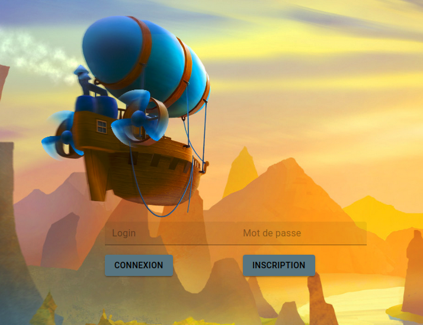
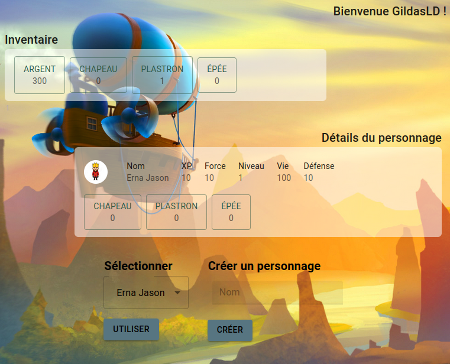
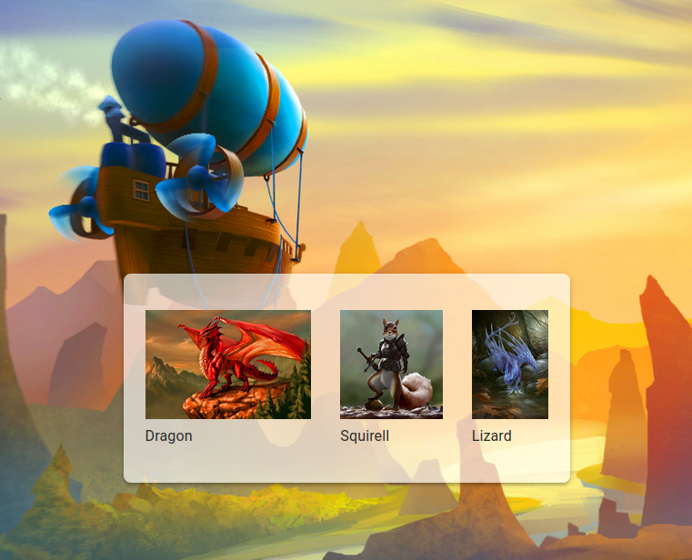
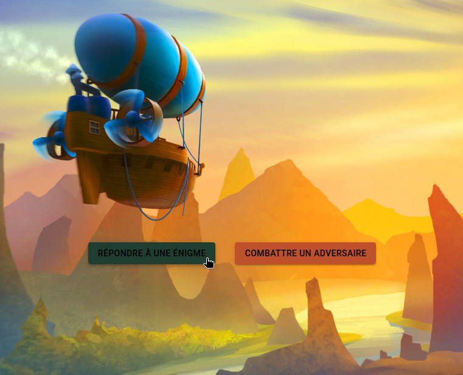
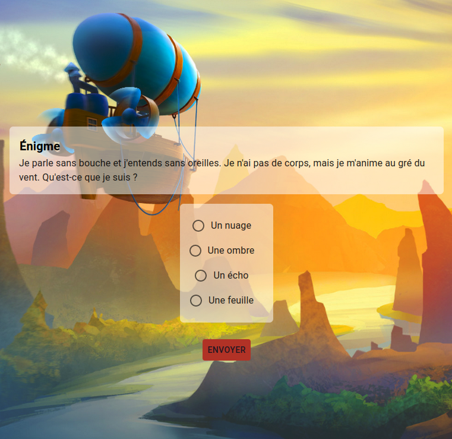

Login : GildasLD:bob

### W4 - Ruby

## RoR - Mediaval RPG

## Introduction

Ce projet a pour but de créer une communauté autour du RPG. 
Il permet à un maître de jeu de faire évoluer des joueurs à travers un ensemble de quêtes.

## Fonctionnalités

### Quêtes

Une quête est divisée en plusieurs étapes. 
À chaque fois qu’une étape est réussie, il est possible de répondre à une énigme.

- Après chaque étape, le joueur reçoit un peu d’expérience.
- En fin de quête, le personnage reçoit beaucoup d’expérience et gagne un objet à équiper.
- Il est possible d’ajouter aux personnages des équipements, des caractéristiques.

### Joueur

- Le joueur peut consulter ses caractéristiques (Expérience, Vie et Force)
- Un inventaire permettant d’équiper 3 objets (chapeau, arme, bouclier), à choisir parmi son inventaire.
- Chaque objet altère la Force, la Vie, peut accroître l’expérience gagnée à chaque étape, ou bien plusieurs de ces bonus/malus à la fois. En fin de quête, il est proposé au joueur de récupérer 1 objet parmi plusieurs qui lui sont proposés.

## Interface

Il est possible de créer un nouveau personnage ou de choisir un personnage déjà existant. Un menu permet ensuite de :

- Consulter ses caractéristiques.
- Gérer son inventaire.
- Choisir une nouvelle quête dans une liste ou continuer une quête en cours. Avoir accès à l’énigme et aux différentes options possibles.

## Expérience

Les points d’expérience accumulés permettent d’ajouter quelques points dans les caractéristiques de son choix. Une fois ces points attribués, ils ne sont plus modifiables. Au début du jeu, le joueur doit commencer avec un personnage de niveau 1, Force 10, PV 10, et doit attribuer 10 points de caractéristique.

## Demo

